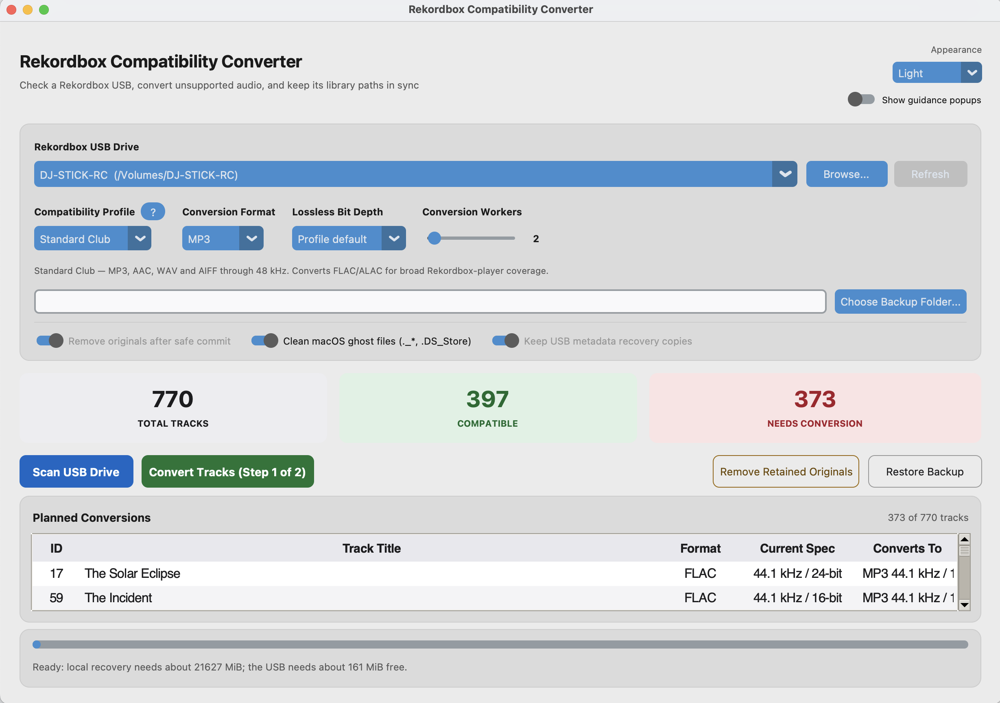

# Rekordbox Compatibility Converter

[](https://python.org)
[](LICENSE)

A desktop app for checking a Rekordbox USB and converting tracks that older CDJ and XDJ players cannot read.

[Download the latest desktop release](https://github.com/resonantcircuits/rekordbox-compatibility-converter/releases/latest)

Releases are available for Apple Silicon Macs, Intel Macs, and 64-bit Windows. FFmpeg and ffprobe are included; no Python or FFmpeg installation is needed.

> The desktop builds are currently unsigned. macOS Gatekeeper or Windows SmartScreen may ask you to approve the first launch.

## Desktop app



1. Keep a separate backup of the USB.
2. Connect the Rekordbox USB and select it in the app.
3. Choose the hardware profile and scan the library.
4. Review the affected tracks, choose a local recovery folder, and start conversion.
5. Verify the USB in Rekordbox and on the equipment you intend to use.

The app updates the traditional Device Library (`export.pdb`) and its referenced waveform, beatgrid, and cue analysis files. If the USB also contains OneLibrary, the app explains the required two-step Rekordbox workflow before making changes.

## What it handles

- FLAC, ALAC, high-sample-rate audio, and optional 16-bit normalization
- AIFF, WAV, or 320 kbps MP3 output
- Device Library paths and audio metadata
- Legacy, RGB, and 3-band waveform sidecars (`.DAT`, `.EXT`, and `.2EX`)
- Verified local recovery archives for originals and Rekordbox metadata
- Existing-target checks, path containment, available-space checks, and rollback
- AppleDouble (`._*`) and `.DS_Store` cleanup

Hardware support differs by profile and exact player model. See [Compatibility profiles](docs/compatibility.md) before preparing a USB for unfamiliar equipment.

## Documentation

- [Installation and desktop downloads](docs/installation.md)
- [Compatibility profiles and supported players](docs/compatibility.md)
- [Using the desktop app and CLI](docs/usage.md)
- [Recovery archives and OneLibrary](docs/recovery-and-onelibrary.md)
- [Development, packaging, and releases](docs/development.md)

## Run from source

Source installs require Python 3.9+, `uv`, FFmpeg, and ffprobe:

```bash
uv sync --extra dev
uv run rbconvert-gui
```

CLI commands remain available through `uv run rbconvert`. See the [usage guide](docs/usage.md#command-line-interface).

## License

[MIT](LICENSE). Desktop releases include the applicable third-party notices, licence texts, FFmpeg build configuration, and corresponding source archive.
